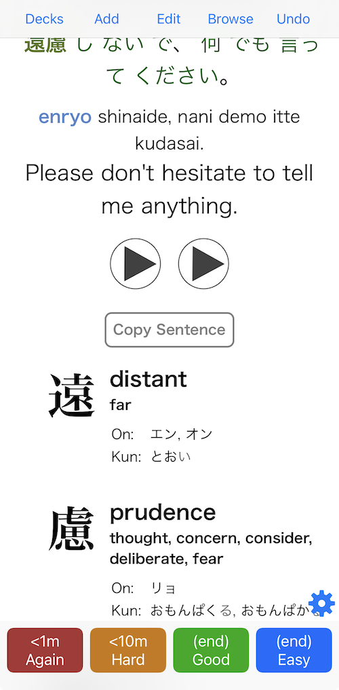

# kanji-list-for-anki
This Javascript will parse a string containing kanji and return a list of them with the keyword, other definitions, onyomi, and kunyomi.

## Usage

1. Place the `_kanjidict.js` file into your `collection.media` folder.

2. Put this code in your Anki card where you want the kanji list to appear:
```
<div id="kanjilist"></div>
```

3. And then put this code at the bottom of your card.
Where I've got `kanji:Sentence`, make sure this references the field where your Japanese sentence is.
```
<script>
	function loadScript(src, callback) {
		var script = document.createElement('script');
		script.src = src;
		script.onload = callback;
		document.head.appendChild(script);
	}

	loadScript('_kanjidict.js', function() {
		//kanji list
		document.getElementById('kanjilist').innerHTML = listKanji("{{kanji:Sentence}}")
	});
</script>
```

(I delay the execution of the script because, on iOS at least, Javascript tends to break on the first card displayed.)

## Result
It should look something like this:



The inserted HTML looks like this:
```
<div id="kanjilist"><ul id="kanjilist">
			<li>
				<h4>遠</h4>
				<div>
					<h5>distant</h5>
					<h6>far</h6>
					<table>
						<tbody><tr><td>On: </td><td>エン, オン</td></tr>
						<tr><td>Kun: </td><td>とお<span class="optional">い</span></td></tr>
					</tbody></table>
				</div>
			</li>

			<li>
				<h4>慮</h4>
				<div>
					<h5>prudence</h5>
					<h6>thought, concern, consider, deliberate, fear</h6>
					<table>
						<tbody><tr><td>On: </td><td>リョ</td></tr>
						<tr><td>Kun: </td><td>おもんぱく<span class="optional">る</span>, おもんぱか<span class="optional">る</span></td></tr>
					</tbody></table>
				</div>
			</li>

			<li>
				<h4>何</h4>
				<div>
					<h5>what</h5>
					
					<table>
						<tbody><tr><td>On: </td><td>カ</td></tr>
						<tr><td>Kun: </td><td>なに, なん, なに-, なん-</td></tr>
					</tbody></table>
				</div>
			</li>

			<li>
				<h4>言</h4>
				<div>
					<h5>say</h5>
					<h6>word</h6>
					<table>
						<tbody><tr><td>On: </td><td>ゲン, ゴン</td></tr>
						<tr><td>Kun: </td><td>い<span class="optional">う</span>, こと</td></tr>
					</tbody></table>
				</div>
			</li>
</ul></div>
```

and its injected CSS looks like this:

```
/*kanjilist*/
#kanjilist {
	font-size: 16px;
	line-height: 1.25em;
	margin-top: 1em;
	list-style-type: none;
}

#kanjilist li {
	margin-top: 0;
	line-height: 1.5em;
	margin-bottom: 2em;
	display: flex;
}

#kanjilist h4 {
	font-family: "RyuminPro";
	font-size: 3.5em;
	line-height: 1em;
	margin: 0 16px 0 0;
	padding-top: 10px;
}

#kanjilist h5 {
	font-size: 1.5em;
	line-height: 1.5em;
	margin: 0;
}

#kanjilist h6 {
	font-size: 1em;
	margin: 0 0 0.5em;
}

#kanjilist .optional {
	opacity: 0.6
}

#kanjilist  td {
	vertical-align: top;
	padding: 0;
}

#kanjilist  td:first-child {
	padding-right: 0.5em;
}
```
